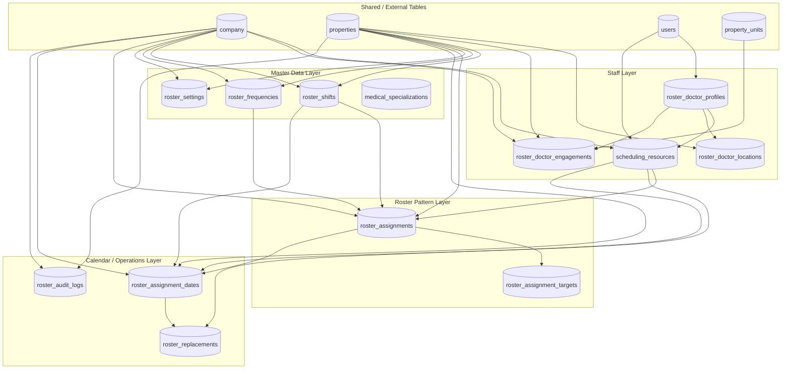
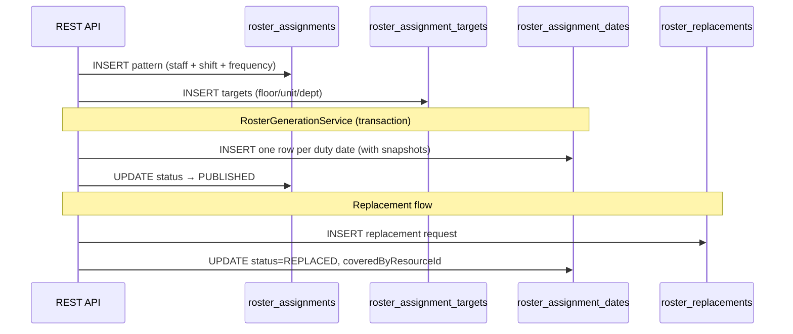

# Roster Management — Database Connection Diagram

> **Database:** MySQL (`rely_active_new`) via Sequelize  
> **ORM:** `src/config/db/index.ts` → `src/models/*.model.ts`  
> **Migration source:** `src/migrations/20260831200000-create-shift-and-roster-tables.ts`

---

## High-Level DB Layers

---

## Full ER Diagram (Tables + FK Connections)

```mermaid
erDiagram
    company ||--o{ scheduling_resources : "companyId CASCADE"
    company ||--o{ roster_doctor_engagements : "companyId CASCADE"
    company ||--o{ roster_shifts : "companyId CASCADE"
    company ||--o{ roster_frequencies : "companyId CASCADE"
    company ||--o{ roster_assignments : "companyId CASCADE"
    company ||--o{ roster_assignment_dates : "companyId CASCADE"
    company ||--o{ roster_settings : "companyId CASCADE"
    company ||--o{ roster_audit_logs : "companyId CASCADE"

    properties ||--o{ roster_doctor_locations : "locationId CASCADE"
    properties ||--o{ roster_doctor_engagements : "locationId CASCADE"
    properties ||--o{ roster_shifts : "locationId CASCADE"
    properties ||--o{ roster_frequencies : "locationId CASCADE"
    properties ||--o{ roster_assignments : "locationId CASCADE"
    properties ||--o{ roster_assignment_dates : "locationId CASCADE"
    properties ||--o{ roster_settings : "locationId CASCADE"
    properties ||--o{ roster_audit_logs : "locationId CASCADE"

    users ||--o| roster_doctor_profiles : "userId CASCADE unique"
    users ||--o{ scheduling_resources : "userId SET NULL"

    roster_doctor_profiles ||--o{ scheduling_resources : "doctorProfileId SET NULL"
    roster_doctor_profiles ||--o{ roster_doctor_locations : "doctorProfileId CASCADE"
    roster_doctor_profiles ||--o{ roster_doctor_engagements : "doctorProfileId CASCADE"

    property_units ||--o{ roster_doctor_engagements : "clinicRoomId SET NULL"

    scheduling_resources ||--o{ roster_assignments : "schedulingResourceId CASCADE"
    roster_shifts ||--o{ roster_assignments : "shiftId SET NULL"
    roster_frequencies ||--o{ roster_assignments : "frequencyId RESTRICT"

    roster_assignments ||--o{ roster_assignment_targets : "rosterAssignmentId CASCADE"
    roster_assignments ||--o{ roster_assignment_dates : "rosterAssignmentId CASCADE"

    scheduling_resources ||--o{ roster_assignment_dates : "schedulingResourceId CASCADE"
    roster_shifts ||--o{ roster_assignment_dates : "shiftId SET NULL"
    scheduling_resources ||--o{ roster_assignment_dates : "coveredByResourceId SET NULL"

    roster_assignment_dates ||--o{ roster_replacements : "rosterAssignmentDateId CASCADE"
    scheduling_resources ||--o{ roster_replacements : "originalResourceId CASCADE"
    scheduling_resources ||--o{ roster_replacements : "replacementResourceId CASCADE"

    company {
        uuid id PK
    }

    properties {
        uuid id PK
    }

    users {
        uuid id PK
    }

    property_units {
        uuid id PK
    }

    roster_doctor_profiles {
        uuid id PK
        uuid userId FK "UNIQUE"
        enum doctorType
        string specialization
        string medicalLicenseNumber
    }

    scheduling_resources {
        uuid id PK
        uuid companyId FK
        enum resourceType "EMPLOYEE | DOCTOR"
        uuid userId FK "nullable"
        uuid doctorProfileId FK "nullable"
        enum status
        date effectiveFrom
        date effectiveUntil
    }

    roster_doctor_locations {
        uuid id PK
        uuid doctorProfileId FK
        uuid locationId FK
        date validFrom
        date validUntil
    }

    roster_doctor_engagements {
        uuid id PK
        uuid doctorProfileId FK
        uuid companyId FK
        uuid locationId FK
        uuid clinicRoomId FK "nullable"
        date validFrom
        date validUntil
    }

    roster_shifts {
        uuid id PK
        uuid companyId FK
        uuid locationId FK
        string shiftName
        string code
        string startTime
        string endTime
        enum slotGenerationMode
        enum status
    }

    roster_frequencies {
        uuid id PK
        uuid companyId FK
        uuid locationId FK
        string frequencyName
        enum frequencyType
        int interval
        enum timeUnit
        json allowedDaysOfWeek
        json monthlyDays
    }

    roster_settings {
        uuid id PK
        uuid companyId FK
        uuid locationId FK "UNIQUE with companyId"
        int minRestPeriodHours
        int maxWeeklyHours
    }

    roster_assignments {
        uuid id PK
        uuid companyId FK
        uuid locationId FK
        string rosterName
        uuid schedulingResourceId FK
        uuid shiftId FK "nullable"
        uuid frequencyId FK
        date effectiveFrom
        date effectiveUntil
        json selectedWorkingDays
        enum status
    }

    roster_assignment_targets {
        uuid id PK
        uuid rosterAssignmentId FK
        enum targetType
        string targetId "polymorphic — no DB FK"
    }

    roster_assignment_dates {
        uuid id PK
        uuid companyId FK
        uuid locationId FK
        uuid rosterAssignmentId FK
        date assignmentDate
        uuid schedulingResourceId FK
        uuid shiftId FK "nullable"
        datetime scheduledStart
        datetime scheduledEnd
        string shiftNameSnapshot
        string targetSnapshot
        string resourceSnapshot
        enum status
        enum attendanceStatus
        uuid coveredByResourceId FK "nullable"
        string activeToken "UNIQUE conflict guard"
    }

    roster_replacements {
        uuid id PK
        uuid rosterAssignmentDateId FK
        uuid originalResourceId FK
        uuid replacementResourceId FK
        enum status
    }

    roster_audit_logs {
        uuid id PK
        uuid companyId FK
        uuid locationId FK
        string entityType
        uuid entityId
        string action
        json previousValues
        json newValues
    }

    medical_specializations {
        uuid id PK
        string name
        enum status
    }
```

---

## Foreign Key Reference Table

| From Table                  | Column                   | → To Table                   | On Update | On Delete    |
| --------------------------- | ------------------------ | ---------------------------- | --------- | ------------ |
| `roster_doctor_profiles`    | `userId`                 | `users.id`                   | CASCADE   | CASCADE      |
| `scheduling_resources`      | `companyId`              | `company.id`                 | CASCADE   | CASCADE      |
| `scheduling_resources`      | `userId`                 | `users.id`                   | CASCADE   | SET NULL     |
| `scheduling_resources`      | `doctorProfileId`        | `roster_doctor_profiles.id`  | CASCADE   | SET NULL     |
| `roster_doctor_locations`   | `doctorProfileId`        | `roster_doctor_profiles.id`  | CASCADE   | CASCADE      |
| `roster_doctor_locations`   | `locationId`             | `properties.id`              | CASCADE   | CASCADE      |
| `roster_doctor_engagements` | `doctorProfileId`        | `roster_doctor_profiles.id`  | CASCADE   | CASCADE      |
| `roster_doctor_engagements` | `companyId`              | `company.id`                 | CASCADE   | CASCADE      |
| `roster_doctor_engagements` | `locationId`             | `properties.id`              | CASCADE   | CASCADE      |
| `roster_doctor_engagements` | `clinicRoomId`           | `property_units.id`          | CASCADE   | SET NULL     |
| `roster_shifts`             | `companyId`              | `company.id`                 | CASCADE   | CASCADE      |
| `roster_shifts`             | `locationId`             | `properties.id`              | CASCADE   | CASCADE      |
| `roster_frequencies`        | `companyId`              | `company.id`                 | CASCADE   | CASCADE      |
| `roster_frequencies`        | `locationId`             | `properties.id`              | CASCADE   | CASCADE      |
| `roster_assignments`        | `companyId`              | `company.id`                 | CASCADE   | CASCADE      |
| `roster_assignments`        | `locationId`             | `properties.id`              | CASCADE   | CASCADE      |
| `roster_assignments`        | `schedulingResourceId`   | `scheduling_resources.id`    | CASCADE   | CASCADE      |
| `roster_assignments`        | `shiftId`                | `roster_shifts.id`           | CASCADE   | SET NULL     |
| `roster_assignments`        | `frequencyId`            | `roster_frequencies.id`      | CASCADE   | **RESTRICT** |
| `roster_assignment_targets` | `rosterAssignmentId`     | `roster_assignments.id`      | CASCADE   | CASCADE      |
| `roster_assignment_dates`   | `companyId`              | `company.id`                 | CASCADE   | CASCADE      |
| `roster_assignment_dates`   | `locationId`             | `properties.id`              | CASCADE   | CASCADE      |
| `roster_assignment_dates`   | `rosterAssignmentId`     | `roster_assignments.id`      | CASCADE   | CASCADE      |
| `roster_assignment_dates`   | `schedulingResourceId`   | `scheduling_resources.id`    | CASCADE   | CASCADE      |
| `roster_assignment_dates`   | `shiftId`                | `roster_shifts.id`           | CASCADE   | SET NULL     |
| `roster_assignment_dates`   | `coveredByResourceId`    | `scheduling_resources.id`    | CASCADE   | SET NULL     |
| `roster_replacements`       | `rosterAssignmentDateId` | `roster_assignment_dates.id` | CASCADE   | CASCADE      |
| `roster_replacements`       | `originalResourceId`     | `scheduling_resources.id`    | CASCADE   | CASCADE      |
| `roster_replacements`       | `replacementResourceId`  | `scheduling_resources.id`    | CASCADE   | CASCADE      |
| `roster_settings`           | `companyId`              | `company.id`                 | CASCADE   | CASCADE      |
| `roster_settings`           | `locationId`             | `properties.id`              | CASCADE   | CASCADE      |
| `roster_audit_logs`         | `companyId`              | `company.id`                 | CASCADE   | CASCADE      |
| `roster_audit_logs`         | `locationId`             | `properties.id`              | CASCADE   | CASCADE      |

---

## Data Generation Flow (DB Writes)

---

## Key Indexes & Constraints

| Table                       | Index / Constraint                                                                       | Purpose                        |
| --------------------------- | ---------------------------------------------------------------------------------------- | ------------------------------ |
| `roster_doctor_profiles`    | UNIQUE `userId`                                                                          | One doctor profile per user    |
| `scheduling_resources`      | `(companyId, resourceType)`                                                              | Fast lookup by company + type  |
| `roster_shifts`             | `(locationId, code)`                                                                     | Unique shift code per location |
| `roster_assignments`        | `(locationId, schedulingResourceId, status)`                                             | Assignment list queries        |
| `roster_assignment_targets` | `(rosterAssignmentId, targetType, targetId)`                                             | Target dedup / lookup          |
| `roster_assignment_dates`   | UNIQUE `(locationId, schedulingResourceId, assignmentDate, scheduledStart, activeToken)` | Prevent double-booking         |
| `roster_settings`           | UNIQUE `(companyId, locationId)`                                                         | One policy row per location    |

---

## Polymorphic Target (No DB FK)

`roster_assignment_targets.targetId` is a **string reference** — not enforced by MySQL foreign key.  
It points to different tables based on `targetType`:

| targetType       | Logical Reference     |
| ---------------- | --------------------- |
| `PROPERTY`       | `properties.id`       |
| `PROPERTY_BLOCK` | property block entity |
| `PROPERTY_FLOOR` | property floor entity |
| `PROPERTY_UNIT`  | `property_units.id`   |
| `DEPARTMENT`     | department entity     |
| `CLINIC_VENUE`   | clinic venue entity   |
| `SERVICE`        | service entity        |

---

## Sequelize Model Map

| Sequelize Model          | MySQL Table                 | File                                         |
| ------------------------ | --------------------------- | -------------------------------------------- |
| `RosterDoctorProfile`    | `roster_doctor_profiles`    | `src/models/rosterDoctorProfile.model.ts`    |
| `SchedulingResource`     | `scheduling_resources`      | `src/models/schedulingResource.model.ts`     |
| `RosterDoctorLocation`   | `roster_doctor_locations`   | `src/models/rosterDoctorLocation.model.ts`   |
| `RosterDoctorEngagement` | `roster_doctor_engagements` | `src/models/rosterDoctorEngagement.model.ts` |
| `RosterShift`            | `roster_shifts`             | `src/models/rosterShift.model.ts`            |
| `RosterFrequency`        | `roster_frequencies`        | `src/models/rosterFrequency.model.ts`        |
| `RosterAssignment`       | `roster_assignments`        | `src/models/rosterAssignment.model.ts`       |
| `RosterAssignmentTarget` | `roster_assignment_targets` | `src/models/rosterAssignmentTarget.model.ts` |
| `RosterAssignmentDate`   | `roster_assignment_dates`   | `src/models/rosterAssignmentDate.model.ts`   |
| `RosterReplacement`      | `roster_replacements`       | `src/models/rosterReplacement.model.ts`      |
| `RosterSetting`          | `roster_settings`           | `src/models/rosterSetting.model.ts`          |
| `RosterAuditLog`         | `roster_audit_logs`         | `src/models/rosterAuditLog.model.ts`         |
| `MedicalSpecialization`  | `medical_specializations`   | `src/models/medicalSpecialization.model.ts`  |

Associations are registered in `src/models/index.ts` (Roster & Scheduling section).

---

## Related Docs

- [Roster & Shift Management Flow](./roster-shift-management.md)
