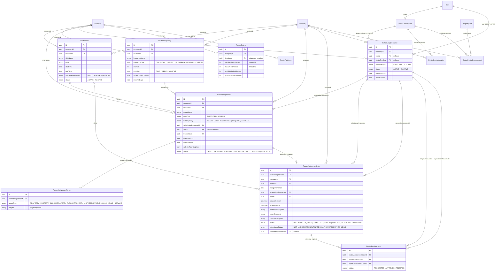
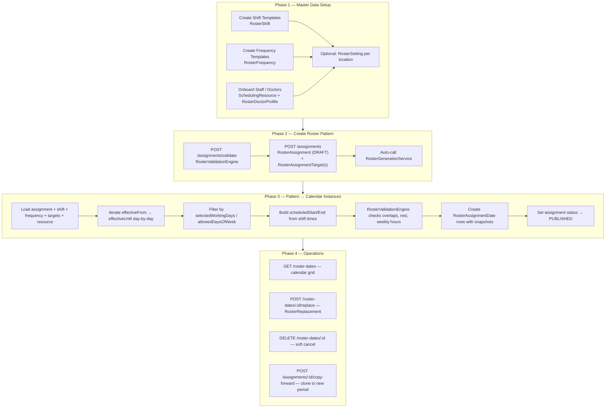

# Roster & Shift Management — Rely-Active-2.0-BE

> **See also:** [Roster DB Connection Diagram](./roster-db-diagram.md) — full MySQL table/FK diagram

The backend uses a **pattern → instance** model. There is no standalone `Roster` table. A roster is built from:

1. **Master data** — shift templates, frequency rules, schedulable staff
2. **Assignment pattern** — who works what, where, and when (recurring rule)
3. **Date instances** — concrete duty rows generated per calendar day

All APIs are mounted at **`/api/v1/roster`**.

---

## Mental Model

| Concept                 | Entity                                        | Role                                                    |
| ----------------------- | --------------------------------------------- | ------------------------------------------------------- |
| **Shift**               | `RosterShift`                                 | Reusable time template (Morning, Night, etc.)           |
| **Roster pattern**      | `RosterAssignment` + `RosterAssignmentTarget` | Staff + shift + frequency + date range + duty locations |
| **Schedule (calendar)** | `RosterAssignmentDate`                        | One row per actual duty day                             |
| **Staff**               | `SchedulingResource`                          | Employee or doctor who can be scheduled                 |
| **Coverage**            | `RosterReplacement`                           | Replacement when someone cannot work                    |

---

## ER Diagram



Associations are defined in `src/models/index.ts` (Roster & Scheduling associations section).

---

## Business Flow



---

## Step-by-Step Flow

### 1. Setup Master Data

**Shifts** — define when work happens (`RosterShift`):

- `POST /companies/:companyId/locations/:locationId/shifts`
- `GET  /companies/:companyId/locations/:locationId/shifts`
- `PUT  /companies/:companyId/locations/:locationId/shifts/:shiftId`

**Frequencies** — define recurrence rules (`RosterFrequency`):

- `POST /companies/:companyId/locations/:locationId/frequencies`
- `GET  /companies/:companyId/locations/:locationId/frequencies`

**Scheduling resources** — employees link to `User`; doctors go through onboarding:

- `POST /companies/:companyId/locations/:locationId/doctors/onboard`
- `GET  /companies/:companyId/locations/:locationId/doctors`
- `POST /doctors/:doctorProfileId/locations`
- `POST /doctors/:doctorProfileId/engagements`

### 2. Create Roster Assignment (Pattern)

A `RosterAssignment` ties together:

- **Who**: `schedulingResourceId`
- **When (time window)**: `shiftId` or `slotTimeRange` (for OPD)
- **When (recurrence)**: `frequencyId` + `effectiveFrom` / `effectiveUntil` + `selectedWorkingDays`
- **Where**: one or more `RosterAssignmentTarget` rows (floor, unit, department, etc.)

| Method | Endpoint                                     | Description                         |
| ------ | -------------------------------------------- | ----------------------------------- |
| POST   | `.../assignments/validate`                   | Pre-flight validation (dry run)     |
| POST   | `.../assignments`                            | Create assignment pattern + targets |
| GET    | `.../assignments`                            | List assignments                    |
| POST   | `.../assignments/:assignmentId/publish`      | Publish and generate instances      |
| POST   | `.../assignments/:assignmentId/copy-forward` | Clone pattern to new date window    |

Before saving, **`RosterValidationEngine`** runs checks:

| Level                 | Rule                                                              | Severity |
| --------------------- | ----------------------------------------------------------------- | -------- |
| Resource auth         | Resource must be ACTIVE; doctors need location scope / engagement | BLOCK    |
| Overlap               | No double-booking on same time slot                               | BLOCK    |
| Rest period           | Min 11h between shifts (from `RosterSetting`)                     | WARNING  |
| Weekly hours          | Max 48h/week for employees                                        | WARNING  |
| Multi-property travel | Buffer between locations                                          | WARNING  |

Warnings require an `overrideReason` to publish.

### 3. Generate Date Instances

`RosterGenerationService.generateDatesForAssignment()` expands the pattern into `RosterAssignmentDate` rows:

1. Load assignment with frequency, shift, targets, and resource (with pessimistic lock)
2. Iterate `effectiveFrom` → `effectiveUntil` day-by-day
3. Filter by `selectedWorkingDays` / `frequency.allowedDaysOfWeek`
4. Build `scheduledStart` / `scheduledEnd` from shift times (overnight-aware)
5. Run `RosterValidationEngine` (blocks vs warnings)
6. Create `RosterAssignmentDate` records with immutable snapshots
7. Set assignment status → `PUBLISHED`

Each `RosterAssignmentDate` stores **snapshots** (`shiftNameSnapshot`, `targetSnapshot`, `resourceSnapshot`) so the calendar stays stable even if master data changes later.

### 4. Day-to-Day Operations

| Action              | Endpoint                                | Effect                                             |
| ------------------- | --------------------------------------- | -------------------------------------------------- |
| View calendar       | `GET .../roster-dates`                  | Query generated instances                          |
| Request replacement | `POST .../roster-dates/:dateId/replace` | Creates `RosterReplacement`, marks date `REPLACED` |
| Cancel a duty       | `DELETE .../roster-dates/:dateId`       | Soft cancel (status `CANCELLED`)                   |
| Copy roster forward | `POST .../assignments/:id/copy-forward` | Clone pattern to a new date window as `DRAFT`      |

---

## Entity Lifecycle States

### RosterAssignment

```
DRAFT → VALIDATED → PUBLISHED → ACTIVE → COMPLETED
                              ↘ CANCELLED
                              ↘ LOCKED
```

### RosterAssignmentDate

```
UPCOMING → ON_DUTY → COMPLETED
         ↘ ABSENT → REPLACEMENT_REQUIRED → REPLACED / COVERED
         ↘ CANCELLED
```

---

## Models & Tables

| Entity                     | Table                       | Purpose                                                        |
| -------------------------- | --------------------------- | -------------------------------------------------------------- |
| **RosterShift**            | `roster_shifts`             | Shift master templates (time windows, slot config)             |
| **RosterFrequency**        | `roster_frequencies`        | Recurrence pattern templates                                   |
| **RosterAssignment**       | `roster_assignments`        | Roster pattern header — staff + shift + date range + frequency |
| **RosterAssignmentTarget** | `roster_assignment_targets` | Where duty applies (floor, unit, department, etc.)             |
| **RosterAssignmentDate**   | `roster_assignment_dates`   | Generated concrete duty/shift instance per date                |
| **SchedulingResource**     | `scheduling_resources`      | Schedulable staff abstraction (EMPLOYEE or DOCTOR)             |
| **RosterDoctorProfile**    | `roster_doctor_profiles`    | Doctor credentials & specialization                            |
| **RosterDoctorLocation**   | `roster_doctor_locations`   | Doctor authorized locations                                    |
| **RosterDoctorEngagement** | `roster_doctor_engagements` | Visiting doctor contracts                                      |
| **RosterReplacement**      | `roster_replacements`       | Shift coverage / replacement audit                             |
| **RosterSetting**          | `roster_settings`           | Location policy (rest hours, weekly limits)                    |
| **RosterAuditLog**         | `roster_audit_logs`         | Audit trail (model exists; no API yet)                         |

---

## Key File Paths

| Category                         | Path                                                              |
| -------------------------------- | ----------------------------------------------------------------- |
| Route mount                      | `src/web-app/routes/roster.routes.ts`                             |
| Assignment controller            | `src/web-app/controllers/rosters/assignment.controller.ts`        |
| Shift controller                 | `src/web-app/controllers/rosters/shift.controller.ts`             |
| Date instance controller         | `src/web-app/controllers/rosters/dateInstance.controller.ts`      |
| Doctor controller                | `src/web-app/controllers/rosters/doctor.controller.ts`            |
| Frequency controller             | `src/web-app/controllers/rosters/frequency.controller.ts`         |
| Generation service               | `src/modules/rosters/domain/roster-generation.service.ts`         |
| Validation engine                | `src/modules/rosters/domain/roster-validation.engine.ts`          |
| Validation schemas               | `src/validations/roster.validation.ts`                            |
| Model associations               | `src/models/index.ts`                                             |
| DB migration (create)            | `src/migrations/20260831200000-create-shift-and-roster-tables.ts` |
| DB migration (production fields) | `src/migrations/20260831220000-add-production-roster-fields.ts`   |
| DB migration (attendance)        | `src/migrations/20260831230000-add-attendance-status-column.ts`   |

---

## Implementation Notes

1. **`createAssignment` auto-publishes** — after creating the pattern, it immediately calls `RosterGenerationService` to generate date rows.
2. **`getRosterDates` auto-publishes DRAFT assignments** if no instances exist yet.
3. **`holidayPolicy`** is stored on assignments but not yet applied during generation.
4. **`RosterSetting`** and **`RosterAuditLog`** exist as models but have no CRUD APIs yet — validation falls back to hardcoded defaults (11h rest, 48h/week).
5. **Employees** can be auto-resolved: passing a `userId` creates a `SchedulingResource` on the fly if one does not exist.
6. **`frequencyType`** (WEEKLY/MONTHLY/etc.) is stored but generation currently uses daily iteration + day-of-week filtering only.

---

## Summary

The roster system separates **what should happen** (`RosterAssignment` pattern) from **what actually happens on each day** (`RosterAssignmentDate` instance). **Shifts** are reusable templates; **frequencies** control recurrence; **scheduling resources** represent staff; **targets** define where duties apply; and **replacements** handle coverage changes. The core engine is the pair **`RosterValidationEngine`** (pre-flight checks) + **`RosterGenerationService`** (pattern expansion into calendar rows).
